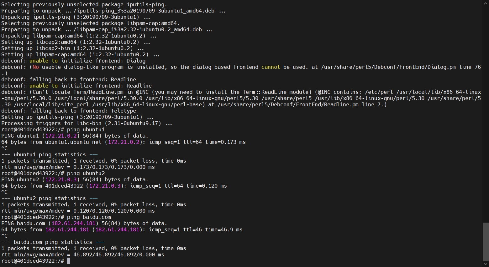

- 第1阶段
  
执行结果见附件

容器能够与各主机互相ping通（docker部分可得60分）
需使用ubuntu:20.04作为基础镜像 
## 创建一个docker网络
```
docker network create ubuntu_net
```

## 启动2个容器
```
docker run -itd --name ubuntu1 --net=ubuntu_net ubuntu:20.04
docker run -itd --name ubuntu2 --net=ubuntu_net ubuntu:20.04
```

## 进入1号容器ping2号容器
```
docker exec -it ubuntu1 /bin/bash
apt-get update
apt-get install iputils-ping -y
ping ubuntu2
ping ubuntu1
ping baidu.com
```

## 进入2号容器ping1号容器
```
docker exec -it ubuntu2 /bin/bash
apt-get update
apt-get install iputils-ping -y
ping ubuntu1
ping baidu.com
ping ubuntu2
```
