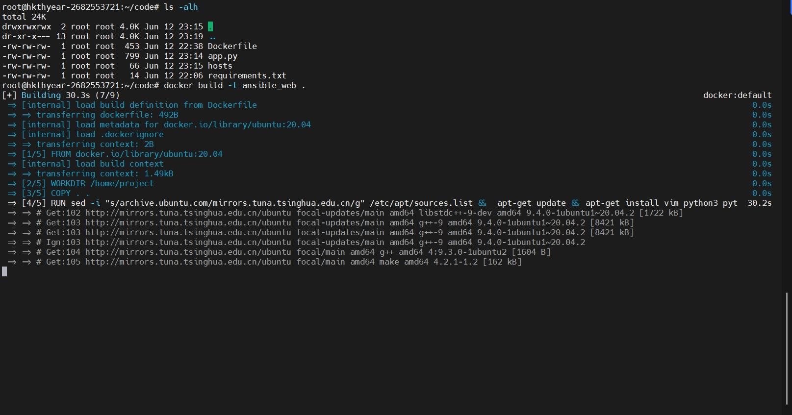
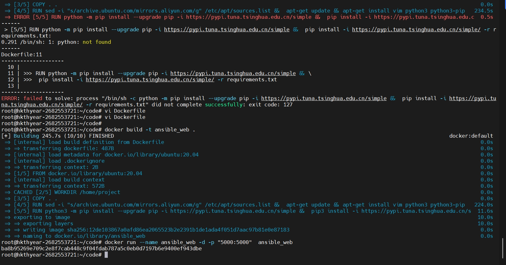
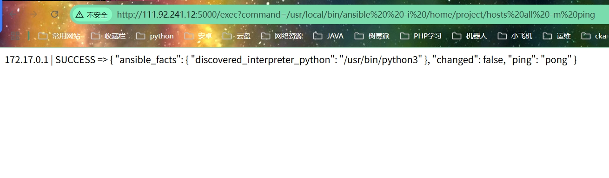

- 第2阶段
通过后端控制，能够使ansible数据正常返回前端并且能够在网页中查看到返回的数据（自动化运维技术部分可得60分，docker正确部署环境可得70分）
要求：
使用docker部署ansible，ansible中的hosts文件可以写死，不做过高要求
前端页面（俗称网页）能否反馈ansible数据即可。例如后端控制执行ansible all -m ping会返回一定的数据，该数据在前端简单展示即可
如果不使用docker部署，则不得分
后端语言不做限制
# 使用说明
- 构建镜像
```
docker build -t ansible_web .
```

# 运行镜像
```
docker run --name ansible_web -d -p "5000:5000"  ansible_web
```

# 运行镜像
```
docker run --name ansible_web -d -p "5000:5000"  ansible_web
```
# 运行结果
浏览器访问网页
http://111.92.241.12:5000/exec?command=/usr/local/bin/ansible%20%20-i%20/home/project/hosts%20all%20-m%20ping
