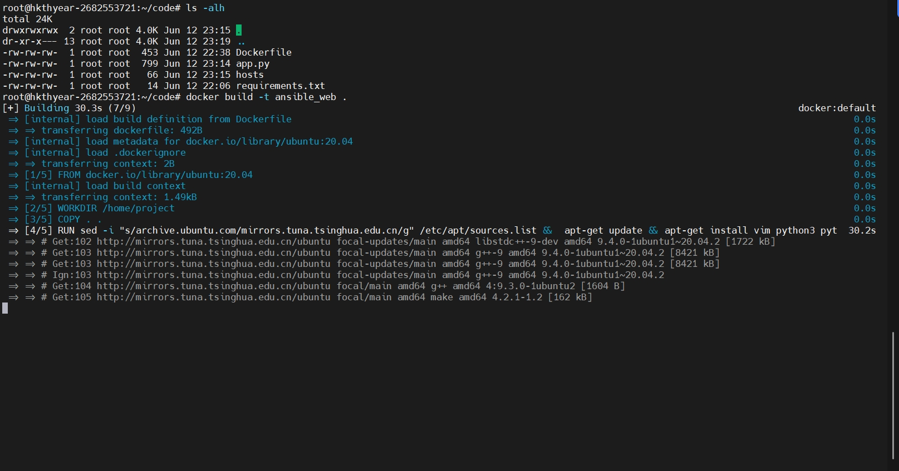
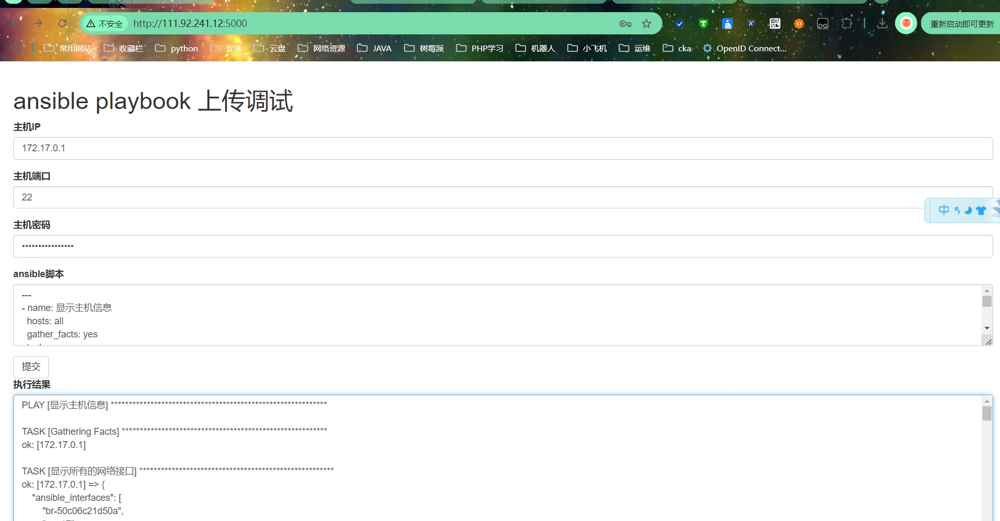

- 第3阶段
改良。使用相关手段（例如shell脚本）对docker网络进行实际自动化探测并修改配置以更方便用户使用（自动化运维技术可得70分，docker部分可得80分）
解释：

如果使用docker进行部署基于ansible的数据化大屏，那么必然需要根据实际情况手动配置网络，这里需要根据实际情况自动配置网络，例如网段、网关、dns等等。目的是方便用户的使用


本阶段实现了网页前端输入服务器IP和密码，上传ansible-playbook，采集目标主机设备信息的功能
所用到的playbook脚本内容
```
---
- name: 显示主机信息
  hosts: all
  gather_facts: yes
  tasks:
    - name: 显示所有的网络接口
      debug:
        var: ansible_interfaces
    - name: 显示指定的网卡
      debug:
        var: ansible_ens17
    - name: 显示总内存
      debug:
        var: ansible_memtotal_mb
    - name: 显示所有IP
      debug:
        var: ansible_ip_addresses
    - name: 显示网关
      debug:
        var: ansible_default_ipv4.gateway
    - name: 显示dns
      debug:
        var: ansible_dns.nameservers
    - name: 显示域名和搜索域
      debug:
        var: ansible_dns.domain
        var: ansible_dns.search
```
# 构建镜像
```
docker build -t ansible_web .
```

# 运行镜像
```
docker run --name ansible_web -d -p "5000:5000"  ansible_web
```

# 运行镜像
```
docker run --name ansible_web -d -p "5000:5000"  ansible_web
```
# 运行效果
