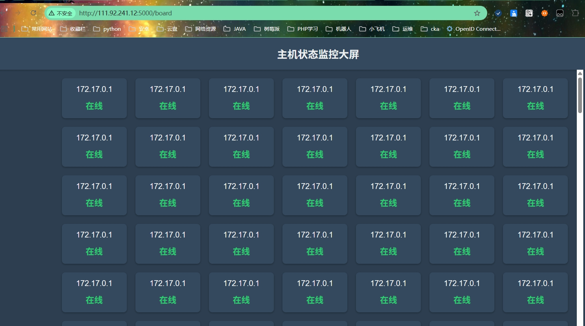

第4阶段
美化。根据ansible返回的数据，简单制作出数据大屏雏形，简单美化前端界面。（自动化运维技术可得80分，docker部分配置正确可得90分）
要求

不得在前端出现返回的ansible数据，否则本阶段不得分
可查看前端示例：http://8.138.131.229/20250507/host_status_monitoring_screen.html
本阶段实现了数据大屏的展示功能，在数据大屏实现主机数据展示功能，在http://localhost:5000/board界面
# 代码说明：
## 数据采集
通过定时调用http://localhost:5000/collect接口，会触发数据采集功能。collect接口会生成根据不同设备生成对应的ansible-playbook,执行对应的playbook后，会将采集到的数据使用post请求推送到http://localhost:5000/status 接口，status接口会将采集到的数据进行存储，存到sqlite数据库中。

## 数据获取
board页面通过get请求调用http://localhost:5000/status 会根据主机ip进行分组展示最新的数据

# 运行效果

# 用到的ansible-playbook脚本

```
---
- name: 收集主机状态信息
  hosts: all
  gather_facts: yes
  tasks:
    - name: 查看设备状态
      ping:
      register: ping_result
      ignore_errors: yes
    - name: 计算已用内存
      set_fact:
        used_memory: "{{ (ansible_memtotal_mb | int) - (ansible_memfree_mb  | int) }}"
      ignore_errors: yes
    - name: 发送数据到flask
      uri:
        url: http://localhost:5000/status
        method: POST
        headers:
          Content-Type: application/json
        body:
          hostname: "{{inventory_hostname}}"
          ip: "{{ansible_default_ipv4.address}}"
          total_memory: "{{ansible_memtotal_mb}}"
          used_memory : "{{used_memory }}"
          status: "{{'success' if ping_result.ping == 'pong' else 'failed'}}"
        body_format: json
      register: status_response
    - name: 打印发送结果
      debug:
        var: status_response.json
```