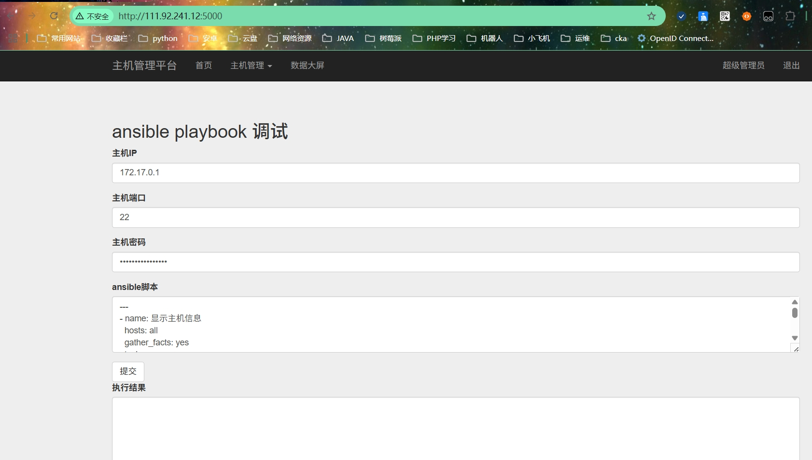
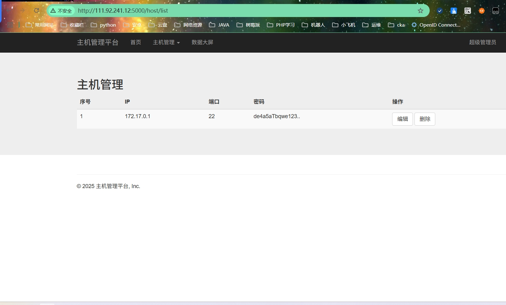
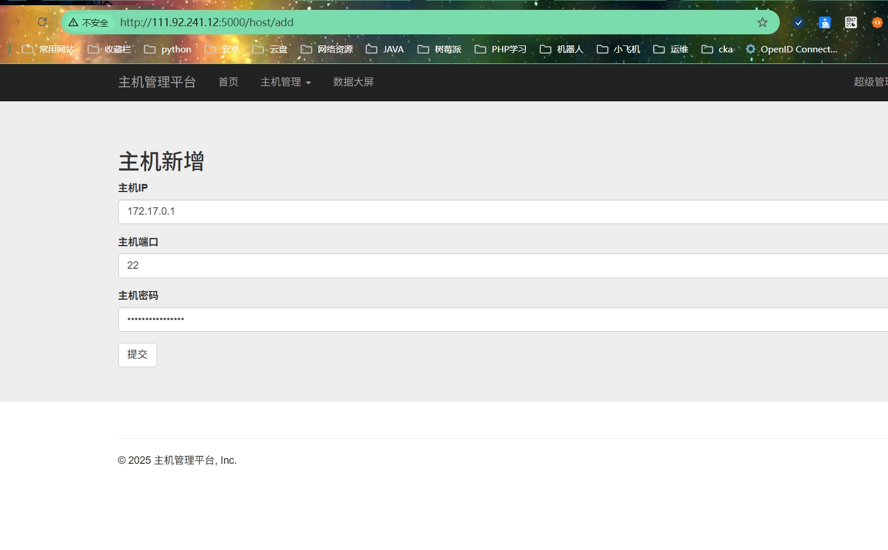
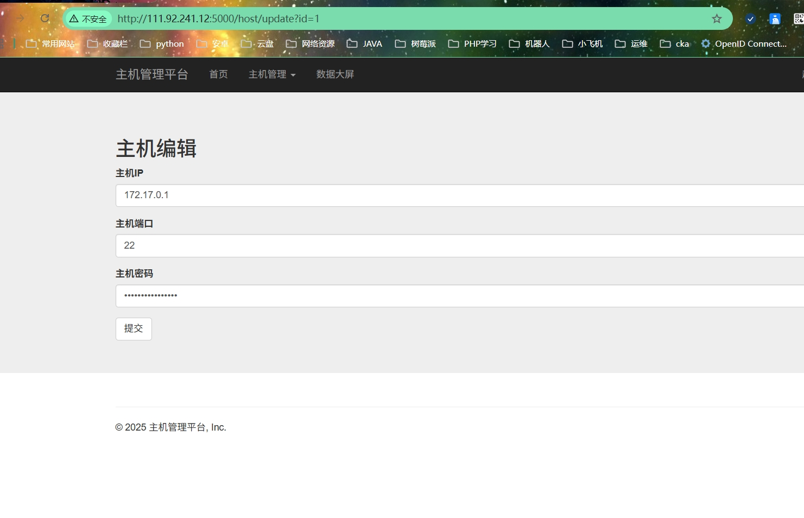
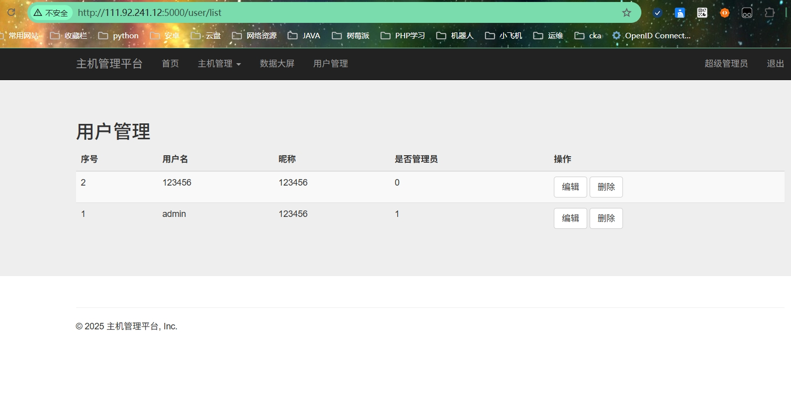
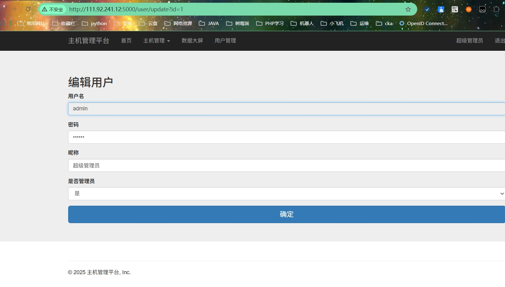
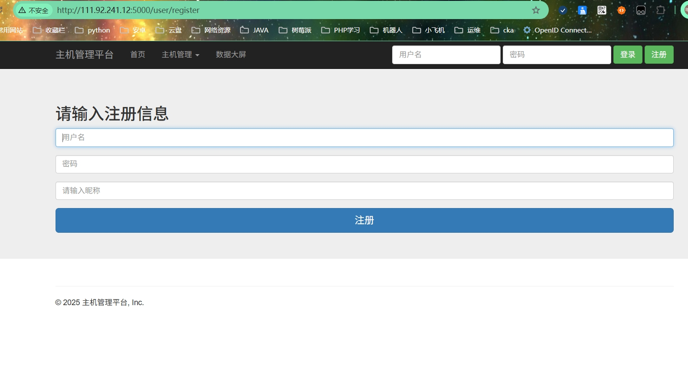
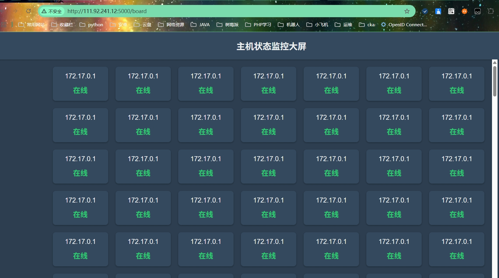
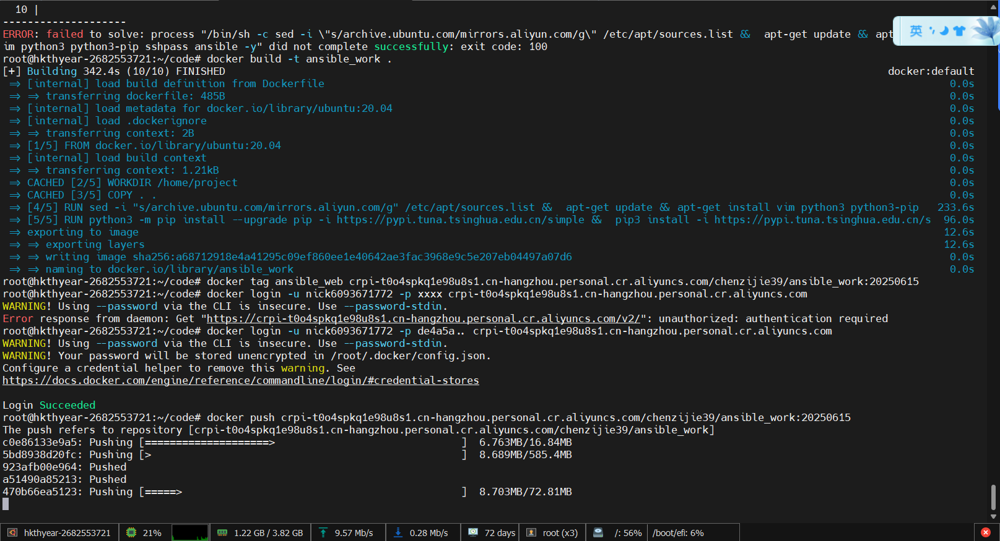

# 第6阶段
  附加分。完成以下任意任务（或者你自己自定义任务）即可获得附加分。
说明

附加分是在完成1~5阶段后的操作，因为1~5阶段未必能拿到相对应的分数，可通过附加分继续得分
加分项

docker容器技术

为了方便用户使用，可以将相关镜像上传到阿里云方便用户下载
其他你自定义的任何功能，说明并实现即可加分
自动化运维技术

通过前后端处理其他的数据，例如资源数据
其他自定义功能说明并实现
前后端

美化前端
管理员登录等
其他自定义功能说明并实现
## 页面美化









## 构建镜像并且上传到阿里云
```
docker build -t ansible_work .
docker tag ansible_web crpi-t0o4spkq1e98u8s1.cn-hangzhou.personal.cr.aliyuncs.com/chenzijie39/ansible_work:20250615
docker login -u nick6093671772 -p xxxx crpi-t0o4spkq1e98u8s1.cn-hangzhou.personal.cr.aliyuncs.com
docker push crpi-t0o4spkq1e98u8s1.cn-hangzhou.personal.cr.aliyuncs.com/chenzijie39/ansible_work:20250615
```

